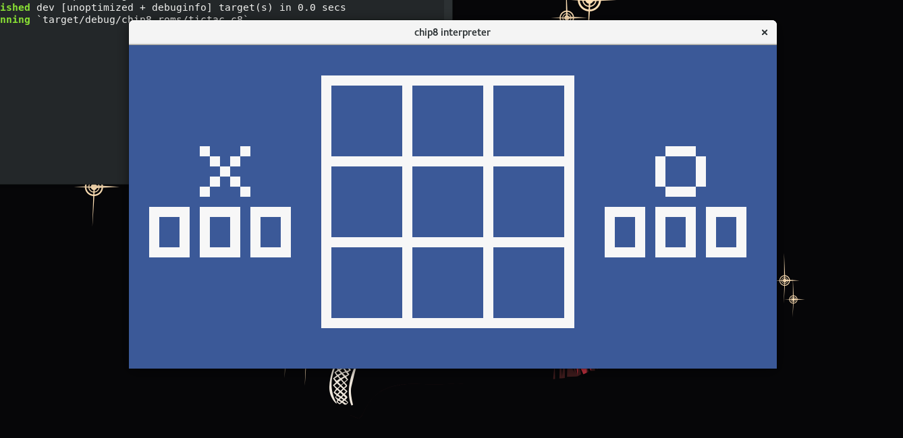

Implementação de um interpretador para linguagem CHIP-8

Seguindo a referência deste link: http://mattmik.com/files/chip8/mastering/chip8.html

Alguns jogos vão precisar que as flags de _quirks_ estejam ativadas.

Screenshots:

